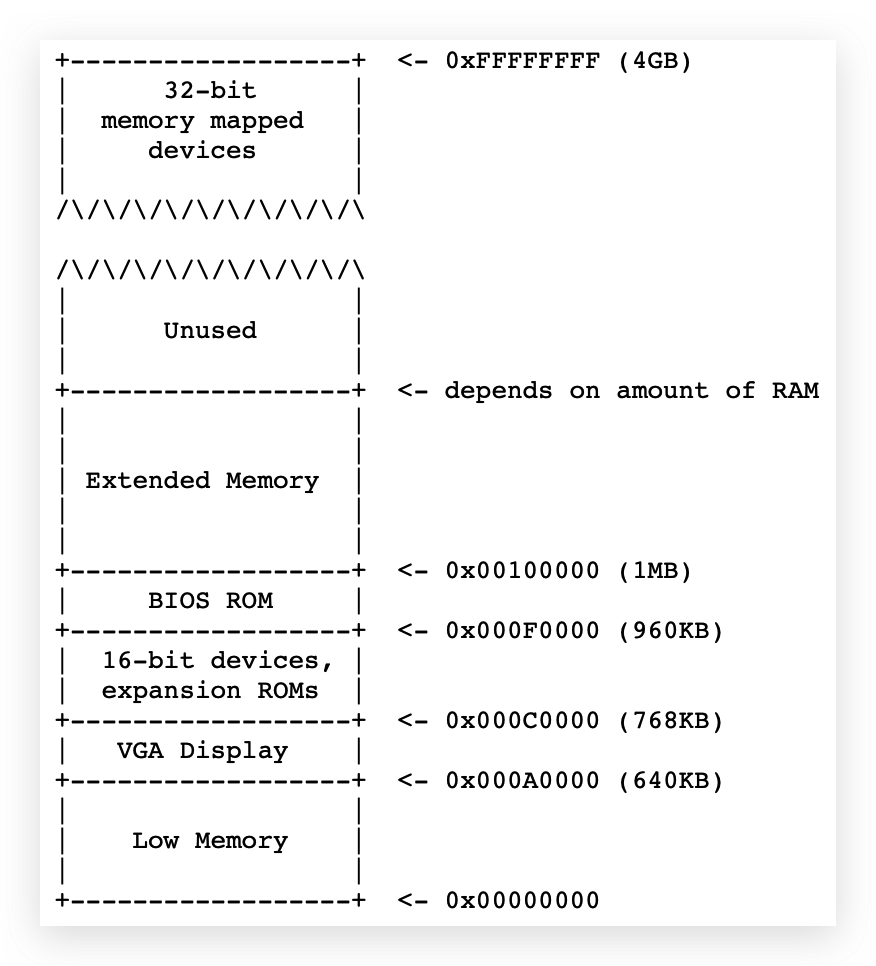
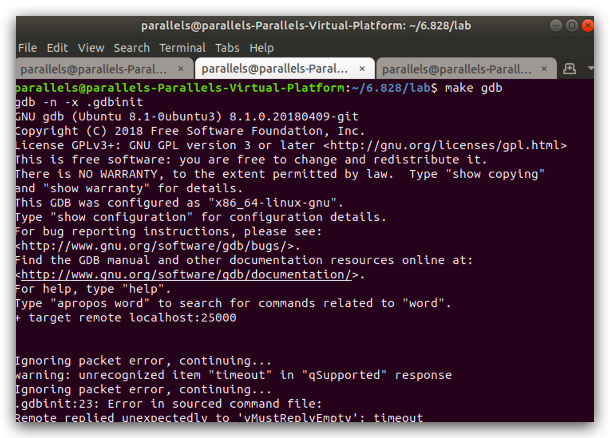
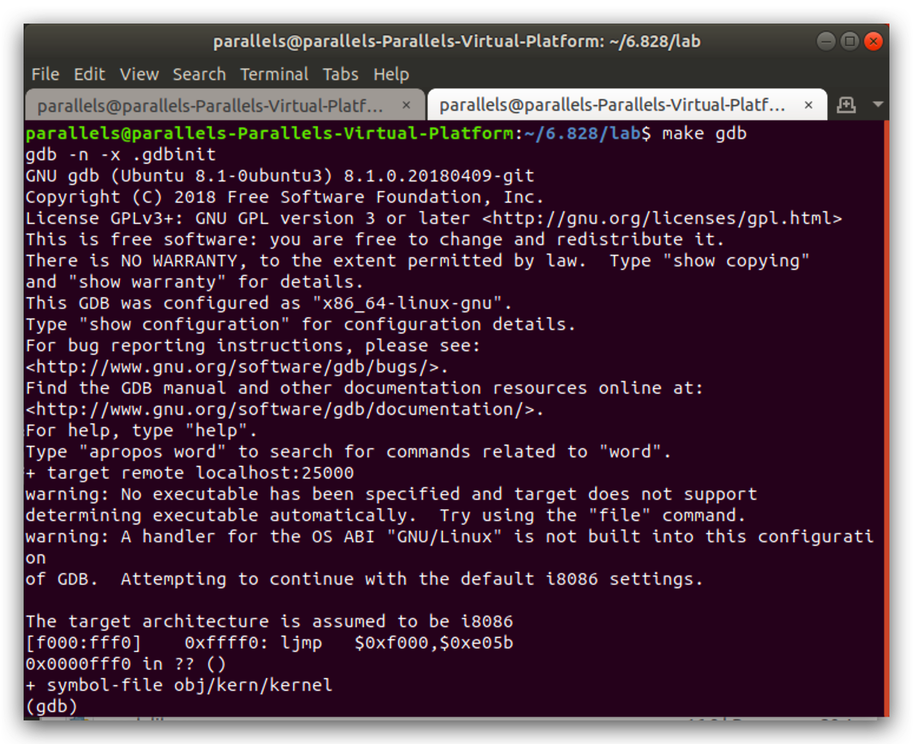
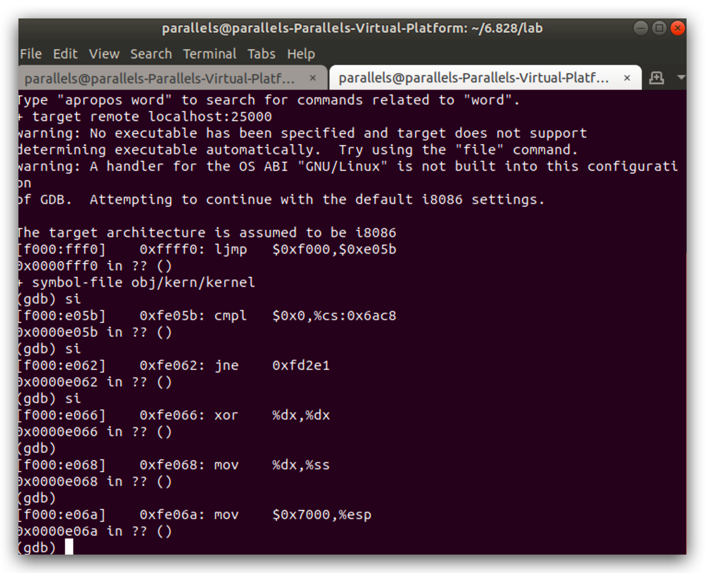

# Lab1

## Part 1

首先，简要阅读一下[Brennan's Guide to Inline Assembly](http://www.delorie.com/djgpp/doc/brennan/brennan_att_inline_djgpp.html)，熟悉AT&T汇编语法。（**Ex1.**）

​	一个典型的32位PC内存分布图如上所示。在最早的时候，PC普遍只有1MB的内存。其中初始的640KB被标记为“Low Memory”，是早期PC唯一能够使用的内存。余下的384KB为保留地址，有其特殊作用：例如BIOS、video显示的缓冲区等。BIOS负责执行基本的系统初始化，如激活显卡和检查已安装的内存数量。在执行此初始化之后，BIOS从某些适当的位置(如 floppy disk(软盘), hard disk, CD-ROM, or the network)加载操作系统，并将机器的控制权传递给操作系统。尽管现代的PC内存中其BIOS已经从Low Memory中提取出来，但之后的PC内存设计均保存了Low Memory以达到向后兼容的目的。

---

​	打开两个终端，均进入到`lab`目录。其中一个执行`make qemu-gdb`，另一个执行`make gdb`。

出现上面这张图的信息，说明存在并行的gdb服务（[ref](https://stackoverflow.com/questions/22373239/gdb-remote-debugging-fails-strangely))，关掉终端重开后👇：

​	注意这里有一条关键的语句`[f000:fff0] 0xffff0: ljmp $0xf000,$0xe05b`。在解析这行代码之前，我们先简要讲一下两个概念。

1. 段寄存器：在AT&T中，存在不同的段，包括代码段CS、数据段DS、堆栈段SS、扩展段ES等，相应寄存器（寄存器名小写，同名）保留着对应段的初始地址。
2. 在实模式寻址中，指令的寻址有如下格式`physical address = 16 * segment + offset.`使用这样的方式是因为我们有1MB即20位的寻址空间，而寄存器只有16位。

回到上面那行指令`[f000:fff0] 0xffff0: ljmp $0xf000,$0xe05b`，以第二个分号为分界，前半部分表示这条指令的地址，后半部分为这条指令的内容；对于前半部分，括号内的即为`segment`和`offset`，计算出的结果即为括号外的内容`0xffff0`，该地址为BIOS结束前的16字节（这也解释了为什么第一条指令会往回跳：16byte的空间基本实现不了什么功能（那为什么不直接从0xfffff开始，空着16byte所为何事？））；对于后半部分，`ljmp`表示段间跳转，其中第一个寄存器为段基地址，第二个为段内偏移。按照实模式寻址的方法，计算出跳转的地址为`0xfe05b`，该地址即为下一条执行指令的地址。

**Ex2**：这里个人感觉就是体会一下`si`单步调试指令的用法，毕竟BIOS的代码太多太长了，一条条分析下去不现实。这里有几篇博客部分分了其中的代码，拿来熟悉AT&T汇编代码也很不错[博客1](https://www.cnblogs.com/fatsheep9146/p/5078179.html)，[博客2](https://blog.csdn.net/old_memory/article/details/79572498)。

此外，自己在`si`的时候发现一个细节：

注意指令的地址，非跳转的相邻指令之间，并不是严格的相差4个字节，存在相差2字节、6字节的情况，这点与MIPS不同。推测是因为AT&T每条指令的长度并不是像MIPS一样固定的。

参考：

* [AT&T汇编指令总结](https://blog.csdn.net/zmcomputer/article/details/5908206)
* [AT&T汇编指令](https://www.cnblogs.com/jokerjason/p/9578646.html)
* [深入理解计算机系统(4) AT&T汇编基本指令](https://www.daimajiaoliu.com/daima/4ed9bac6910040c)

