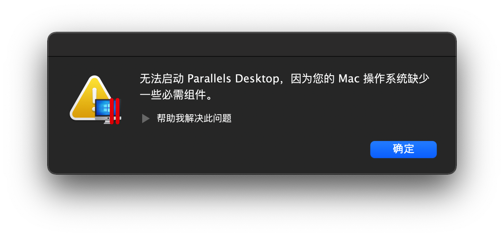
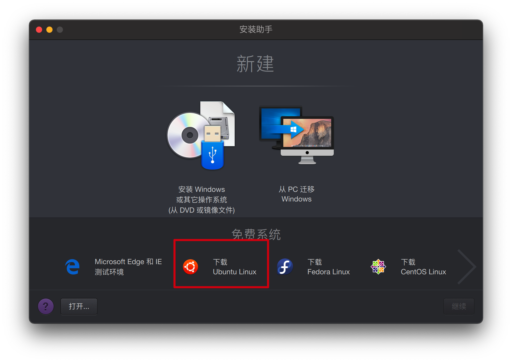
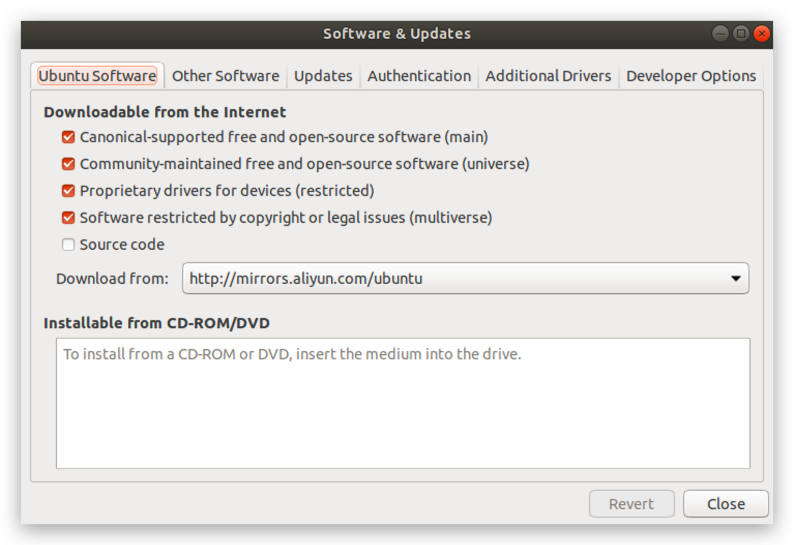
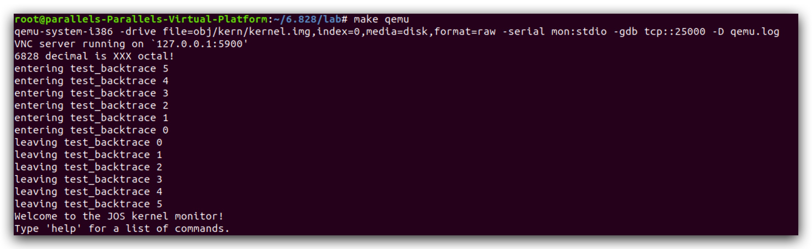

# MIT6.828 环境配置 2022.1.30

本次环境使用Parallels Desktop虚拟机软件安装Ubuntu18.04，理由有以下几点：

1. [官方](https://pdos.csail.mit.edu/6.828/2018/tools.html)推荐的环境即为Linux（虽然是Ubuntu16.04，这里选择18.04是因为Parallels Desktop安装Linux时会默认为18.04；我看网上用什么版本的都有，估计用什么Linux版本问题都不大😂）
2. 官方以及[网上](https://zhayujie.com/mit6828-env.html)的环境搭建教程里也有直接在macOS下搭建的，但考虑到这是一个OS，怕自己太🥬，搭建环境or写lab的时候把本地环境给“污染”了，最终还是决定用虚拟机～🤣
3. 此外，直接使用macOS我怕会对后续的lab有影响，毕竟作者一直使用的是Linux
4. 最重要的是，你的Mac是M1的ARM架构CPU，这里需要使用的环境是x86的，所以直接在Mac上构建环境有极大的可能性出现问题，故虚拟机是最好的方案。😎

​		环境配置主要就是安装并配置QEMU，但奇葩的点在于安装好以后你无法验证自己有没有安装成功（如果没有报错不算成功的话），所以顺便也把lab1的JOS环境也给装上了。QEMU为一个x86硬件模拟器，基于Linux环境；JOS则是运行在QEMU上的一个类unix系统，基于xv6系统开发；xv6则是一个类unix的教学用OS。

​		以下终端中的命令很多都需要使用root权限，每次前面都带一个sudo比较烦，建议直接上来先来个`sudo -u`或者`sudo -s`，进入root模式。（以下一些命令里依旧会带有sudo关键字。

​		此外，以下都会在过程中把参考列出来，但<font color = "red">可以不看参考，仅看这个文档即可。</font>

​		本次我自己的计划是跟着官方的[schedule](https://pdos.csail.mit.edu/6.828/2018/schedule.html)走，我希望重质不重速，也希望咱们彼此能够坚持把这门课程啃完。好了，废话不多说，开整！

#  Parallels Desktop的安装

​		我使用的是18年的PD软件版本，安装包已经上传到iCloud了，可在[这里](https://www.icloud.com.cn/iclouddrive/0b60vdasZP8ePK7WXXPgw4ewQ)下载。这个是破解版，正版要大几百，还不提供年年更新，不像甄总这么有钱，有钱了一定支持（逃。。。

​		这个安装包可能不支持M1，可以去淘宝花个5块钱买个最新版的ಠ_ಠ，或者用VMware，免费。这个我没用过，甄总如果用这个的话可以教教我～

安装了以后会出现如下的报错：



根据[网上](https://blog.csdn.net/weixin_40005874/article/details/112602502)的解决方案，应该是软件与Big Sur系统的兼容性问题，在终端输入以下两条命令即可：

```shell
export SYSTEM_VERSION_COMPAT=1
open -a Parallels\ Desktop.app
```

之后每次打开PD都需要这样打开，如果觉得麻烦可以参考[这里](https://www.jianshu.com/p/ca866786b3a4)的方法使用Apple自带的**自动操作**，就是LaunchPad实用工具里那个小机器人配置一下。我没配，直接一直开着了就，实测资源占用很小。

打开 Parallels Desktop以后，左上角菜单栏`文件`->`新建`。在弹出的窗口中选择下载Ubuntu Linux即可。

等一会儿，下载完按照步骤走就能进入Linux的界面了。虚拟机内存可以分大一点，4G或者6G都行。

# 更换APT源

这一步开始坑巨多。。。

按照网上博客的一些教程的说法（[教程1](https://www.cnblogs.com/JayL-zxl/p/14906344.html)，[教程2](https://zhuanlan.zhihu.com/p/161202840)），直接使用官方的步骤来装基本装不上（Orz。。。），所以就直接照着前人的经验来，首先，得先装个git：`sudo apt install git`，然后你会发现装不上？？？刚开始我还以为是网络的问题，因为虚拟机跟本机没配置过无法共享同一个梯子。试着给虚拟机装个Clash For Linux，并照着[这个](https://www.jianshu.com/p/260fbac1d4a2)折腾了一番最后还是没用。然后转念一想，会不会是apt源的问题，便又跟着这篇[文章](https://www.cnblogs.com/oddcat/articles/9679221.html)更换apt源，结果文章里推荐的清华源过期了。。。期了。。。最后找了阿里云的源。。。说这些是因为最后Linux的梯子还是没配上，虽然暂时用不着，但还是得有。这就靠甄神了🌚🌚🌚。（主要还是太🥬了我🥺

1. 备份

   `cp /etc/apt/sources.list /etc/apt/sources.list.backup`

2. 打开sources.list

   `vim /etc/apt/sources.list`

3. 使用`ggdG`删除所有内容，并insert以下内容，替换为aliyun源，[参考](https://blog.csdn.net/gezongbo/article/details/121056781)：

```
deb http://mirrors.aliyun.com/ubuntu bionic main multiverse restricted universe
deb http://mirrors.aliyun.com/ubuntu bionic-updates main multiverse restricted universe
deb http://mirrors.aliyun.com/ubuntu bionic-security main multiverse restricted universe
deb http://mirrors.aliyun.com/ubuntu bionic-proposed main multiverse restricted universe
deb http://mirrors.aliyun.com/ubuntu bionic-backports main multiverse restricted universe
```

4. 打开系统的`Software&Updates`应用，按下图所示设置：

​	其实这一步可能没必要，踩坑过程中根据[这里](https://blog.csdn.net/guyuealian/article/details/80833986)改的，懒得改回去了。🤷‍♂️

5. 运行`sudo apt-get update`以让新源生效
6. 运行`sudo apt-get install git`，以同样的方法安装vim。

# 安装并配置QEMU

这一步主要参考了这两篇文章，自己整合了一下：[文章一](https://www.cnblogs.com/JayL-zxl/p/14906344.html)  [文章二](https://zhuanlan.zhihu.com/p/161202840)

前面提到过，qemu是一个模拟x86-64硬件的模拟器，安装前首先先安装几个依赖库：

```shell
# 安装编译工具
sudo apt install -y build-essential gdb
# 安装 32-bit 库
sudo apt install gcc-multilib
```

之后就可以安装QEMU了，不建议按照QEMU官方的来，直接clone MIT自己打了补丁的qemu-6.828-v2.3.0。如果速度慢的话直接下载到对应文件夹后解压（其实挺快的），下载[地址](https://github.com/mit-pdos/6.828-qemu)：

```shell
#创建一个文件夹先，名字看你的喜好了，我就直接6.828
cd cd /home/parallels/
mkdir 6.828
cd 6.828
#clone 
git clone http://web.mit.edu/ccutler/www/qemu.git -b 6.828-2.3.0
```

这一步可能会报错：

```shell
~$ git clone https://pdos.csail.mit.edu/6.828/2014/jos.git lab
Cloning into 'lab'...
fatal: unable to access 'https://pdos.csail.mit.edu/6.828/2014/jos.git/': server certificate verification failed. CAfile: /etc/ssl/certs/ca-certificates.crt CRLfile: none
```

意思是咱的电脑不信任MIT的内网哈哈哈，解决方法就是添加个环境变量（[参考](https://blog.csdn.net/poundssss/article/details/50727312)）：

```shell
$ export GIT_SSL_NO_VERIFY=1
```

一般情况下这样就够快了，我虚拟机里没翻墙，一百多兆几分钟完事儿。

下载完以后先安装一个python2.7，用来配置QEMU

```shell
sudo apt-get install python2.7
```

然后使用如下命令配置：

```shell
cd qemu
sudo ./configure --disable-kvm --target-list="i386-softmmu x86_64-softmmu" --python=python2.7
```

---

这一步好像出现过`ERROR: glib-2.xx gthread-2.0 is required to compile QEMU`的error，当时没来及记录，具体的报错信息忘了。解决方法：

```shell
apt-get install build-essential zlib1g-dev pkg-config libglib2.0-dev binutils-dev libboost-all-dev autoconf libtool libssl-dev libpixman-1-dev libpython-dev python-pip python-capstone virtualenv
```

⚠️注意上面是一行，[参考1](https://blog.csdn.net/zhaixuebuluo/article/details/109029919) [参考2](https://github.com/Cisco-Talos/pyrebox/issues/41)

还遇到过`pkg-config not found`的错误，具体哪里遇到的忘了🤦‍♂️，直接install一下就好，[参考](https://blog.csdn.net/banyu0052/article/details/101946224)

```shell
sudo apt-get install pkg-config
```

这里[博客](https://www.cnblogs.com/JayL-zxl/p/14906344.html)里还说可能出现`Disabling libtool due to broken toolchain support`的错误，我没遇到，解决方法是`sudo apt-get install libtool*`（虽然没遇到，但我还是运行了。

**20220301**
在阿里云上配置环境时报错` *** No rule to make target '/home/parallels/6.828/qemu/exec.c', needed by 'exec.o'.  Stop.
Makefile:173: recipe for target 'subdir-i386-softmmu' failed`
解决方法：[参考](https://blog.csdn.net/Yichuan_Sun/article/details/117713328)
注意最后一个translate不改

---

# 编译QEMU

首先，运行一下`make`，当然，猜也猜到了，又有错🤦‍♂️：

```shell
  CC    qga/commands-posix.o
qga/commands-posix.c: In function ‘dev_major_minor’:
qga/commands-posix.c:633:13: error: In the GNU C Library, "major" is defined
 by <sys/sysmacros.h>. For historical compatibility, it is
 currently defined by <sys/types.h> as well, but we plan to
 remove this soon. To use "major", include <sys/sysmacros.h>
 directly. If you did not intend to use a system-defined macro
 "major", you should undefine it after including <sys/types.h>. [-Werror]
         *devmajor = major(st.st_rdev);
             ^~~~~~~~~~~~~~~~~~~~~~~~~~                                                                                                                                                                                                                                                                                                                                              
qga/commands-posix.c:634:13: error: In the GNU C Library, "minor" is defined
 by <sys/sysmacros.h>. For historical compatibility, it is
 currently defined by <sys/types.h> as well, but we plan to
 remove this soon. To use "minor", include <sys/sysmacros.h>
 directly. If you did not intend to use a system-defined macro
 "minor", you should undefine it after including <sys/types.h>. [-Werror]
         *devminor = minor(st.st_rdev);
             ^~~~~~~~~~~~~~~~~~~~~~~~~~                                                                                                                                                                                                                                                                                                                                              
cc1: all warnings being treated as errors
```

问题在于`qga/commands-posix.c`文件中少了一个依赖，添加`#include <sys/sysmacros.h>`。

重新`make`，还是会报错🤦‍♂️。

```shell
block/blkdebug.c: In function ‘blkdebug_refresh_filename’:
block/blkdebug.c:749:31: error: ‘%s’ directive output may be truncated writing up to 4095 bytes into a region of size 4086 [-Werror=format-truncation=]
                  "blkdebug:%s:%s",
                               ^~
In file included from /usr/include/stdio.h:862:0,
                 from /home/wzd/qemu/include/qemu-common.h:27,
                 from block/blkdebug.c:25:
/usr/include/x86_64-linux-gnu/bits/stdio2.h:64:10: note: ‘__builtin___snprintf_chk’ output 11 or more bytes (assuming 4106) into a destination of size 4096
   return __builtin___snprintf_chk (__s, __n, __USE_FORTIFY_LEVEL - 1,
          ^~~~~~~~~~~~~~~~~~~~~~~~~~~~~~~~~~~~~~~~~~~~~~~~~~~~~~~~~~~~
        __bos (__s), __fmt, __va_arg_pack ());
        ~~~~~~~~~~~~~~~~~~~~~~~~~~~~~~~~~~~~~
cc1: all warnings being treated as errors
/home/wzd/qemu/rules.mak:57: recipe for target 'block/blkdebug.o' failed
```

具体原因是啥我也没深究，删了`config-host.mak`文件中的`-Werror`字符串即可。这个文件内容比较多，使用vim打开后直接`/-Werror`搜索。

[参考1](https://blog.csdn.net/q411020382/article/details/104075859)  [参考2](https://blog.csdn.net/Wu1069444514/article/details/89266183)

重新`make`，没报错就算成功了。接着`make install`。

# 安装JOS

上面提到过，以上能够无报错地安装完应该算是成功了。但无法得到验证，所以就干脆把lab1的JOS装上，如果最后成功弹出`Welcome to the JOS kernel monitor!`说明俩环境都成功了。

首先会推到qemu的父目录，并clone lab1的代码[参考](https://zhuanlan.zhihu.com/p/162992417)：

```shell
git clone https://pdos.csail.mit.edu/6.828/2017/jos.git lab
```

后面的lab目录名可自定义。

进入lab目录，make一下：

```shell
cd lab
make
```

是的，又会出错。出错的原因[这篇文章](https://yelleyee.github.io/2017/09/25/mit-os-lab1/)讲的很详细，我没细看，具体的内容应该涉及到lab1实验，到时候可以深究一下，感觉里面学问还挺深的。

```shell
vim kern/kernel.ld
```

将以下内容

```shell
/* Adjust the address for the data segment to the next page */
43		. = ALIGN(0x1000);
44
45		/* The data segment */
46		.data : {
47			*(.data)
48		}
49
50		PROVIDE(edata = .);
51
52		.bss : {
53			*(.bss)
54		}
55
56		PROVIDE(end = .);
```

改为以下：

```shell
/* The data segment */
46		.data : {
47			*(.data)
48		}
49
50		PROVIDE(edata = .);
51		.bss : {
52          edata = .;
53	        *(.bss)
54		}
55
56		PROVIDE(end = .);
```

其实就是插入了一行`edata = .;`

重新`make clean`，然后重新`make`。


出现以上说明make成功。

之后`make qemu`，大功告成🎉🎉🎉



按下`control`+`a`，之后按下`x`即可退出模拟器。

